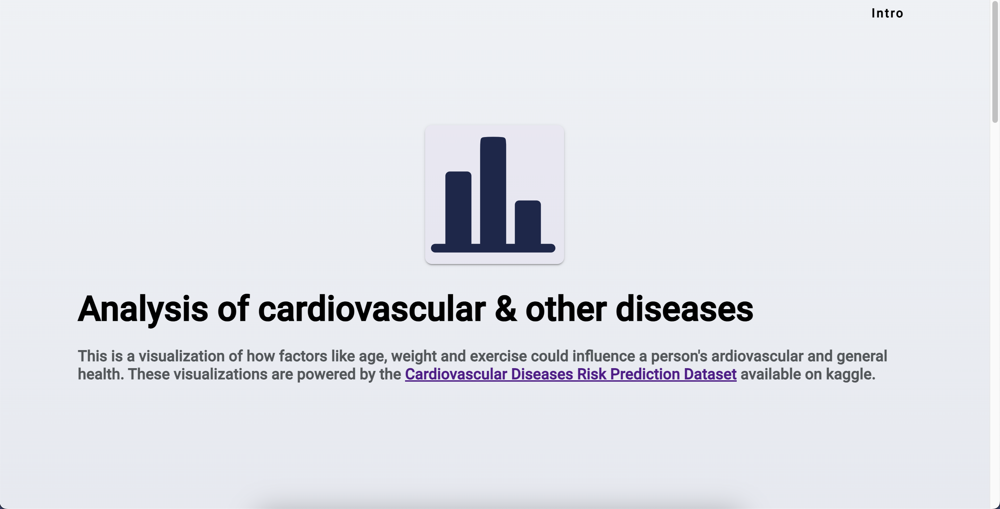
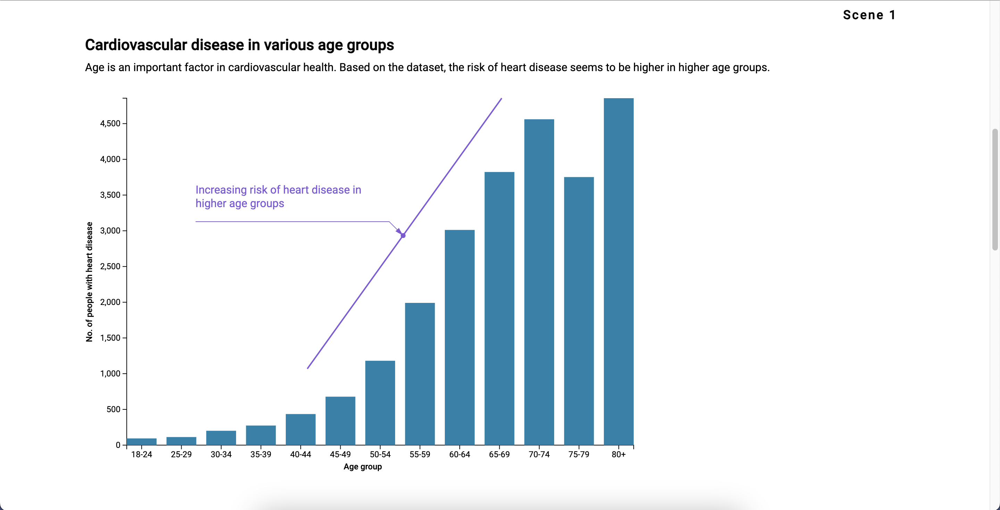
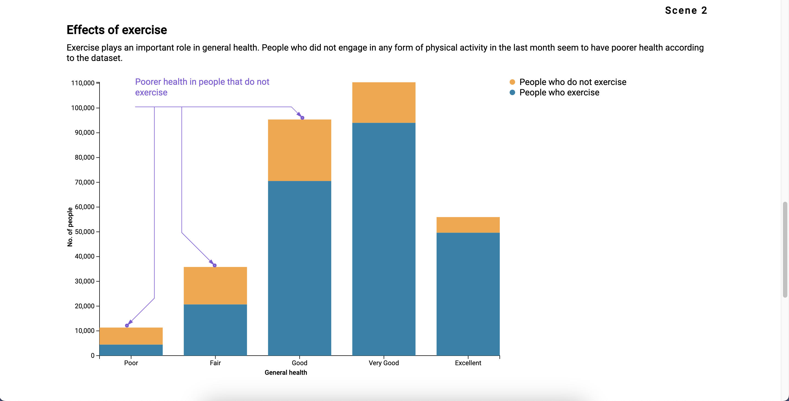
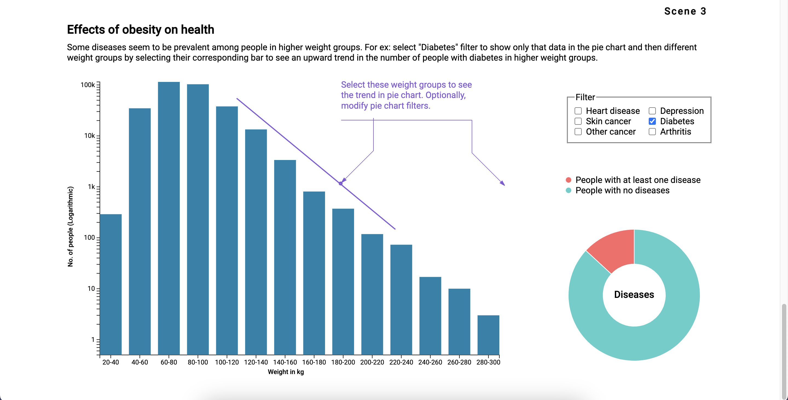

# CS416 Data Visualization
### Analysis of cardiovascular & other diseases
This is a visualization of how factors like age, weight and exercise could influence a person's ardiovascular and general health. These visualizations are powered by the [Cardiovascular Diseases Risk Prediction Dataset](https://www.kaggle.com/datasets/alphiree/cardiovascular-diseases-risk-prediction-dataset) available on kaggle.

#### Intro

#### Scene 1

#### Scene 2

#### Scene 3
